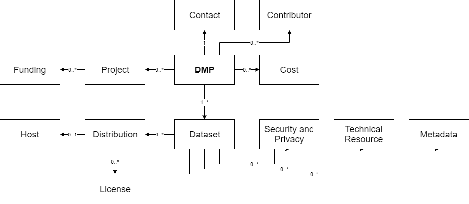

<h1>RDA DMP Common Standard for machine-actionable Data Management Plans</h1><table><tr><td valign="top"><h3>About this document</h3>
This is a metadata application profile to provide basic interoperability between systems producing or consuming machine-actionable data management plans (maDMPS). Further fields can be added in specific deployments, but they do not guarantee interoperability. DMP tools can use any other fields in their internal data models.

This application profile is intended to cover a wide range of use cases and does not set any business (e.g. funder specific) requirements. I represents information over the whole DMP lifecycle.

For more information see <a href="https://github.com/RDA-DMP-Common/RDA-DMP-Common-Standard/tree/master/examples/JSON">examples</a>, <a href="https://github.com/RDA-DMP-Common/RDA-DMP-Common-Standard/blob/master/docs/FAQ.md">FAQ</a> and <a href="https://github.com/RDA-DMP-Common/RDA-DMP-Common-Standard/blob/master/docs/links.md">useful links to consultations, documents, tools, prototypes, etc.</a> developed by the working group.

<h3>DMP</h3>
Provides high level information about the DMP, e.g. its title, modification date, etc. It is the root of this application profile. The majority of its fields are mandatory.

<h3>Project</h3>
Describes the project associated with the DMP, if applicable. It can be used to describe any type of project: that is, not only funded projects, but also internal projects, PhD theses, etc.

<h3>Funding</h3>
For specifying details on funded projects, e.g. NSF of EC funded projects.

<h3>Contact</h3>
Specifies the party which can provide any information on the DMP. This is not necessarily the DMP creator, and can be a person or an organisation.

<h3>Contributor</h3>
For listing all parties involved in the process of the data management described by this DMP, and those parties involved in the creation and management of the DMP itself.

<h3>Cost</h3>
Provides a list of costs related to data management.

<h3>Dataset</h3>
This follows the defintion of Dataset in the W3C DCAT specification. Dataset can be understood as a logical entity depicting data, e.g. raw data. It provides high level information about the data. The granularity of dataset depends on a specific setting. In edge cases it can be a file, but also a collection of files in different formats. See <a href=https://github.com/RDA-DMP-Common/RDA-DMP-Common-Standard/blob/master/docs/FAQ.md>FAQ</a> for more details. 

<h3>Distribution</h3>
This follows the defintion of Distribution in the W3C DCAT specification. Distribution points to a specific instance of a dataset. Hence, distribution contains information such as the format and size of files. A dataset can have several distributions.

<h3>License</h3>
Used to indicate the license under which data (each specific Distribution) will be made available. It also allows for modelling embargoes. See <a href=https://github.com/RDA-DMP-Common/RDA-DMP-Common-Standard/blob/master/docs/FAQ.md>FAQ</a> for more details.

<h3>Host</h3>
Provides information on the system where data is stored. It can be used to provide details on a repository where data is deposited, e.g. a Core Trust Seal certified repository located in Europe that uses DOIs. It can also provide details on systems where data is stored and processed during research, e.g. a high performance computer that uses fast storage with two daily backups.

<h3>Security and Privacy</h3>
Used to indicate any specific requirements related to security and privacy of a specific dataset, e.g. to indicate that data is not anonymized.

<h3>Technical Resource</h3>
For specifying equipment needed/used to create or process the data, e.g. a microscope, etc.  

<h3>Metadata</h3>
Provides a pointer to a metadata standard used to describe the data. It does <b>not</b> contain any actual metadata relating to the dataset.

</td><td valign="top"><h3>Structure</h3><ul><li id="dmp_tree"><a href="#dmp_table">dmp</a></li><ul><li id="dmp_contact_tree"><a href="#dmp_contact_table">contact</a></li><ul><li id="contact_id_tree"><a href="#contact_id_table">contact_id</a></li><ul><li id="contact_id_identifier_tree"><a href="#contact_id_identifier">identifier</a></li><li id="contact_id_type_tree"><a href="#contact_id_type">type</a></li></ul><li id="dmp_contact_mbox_tree"><a href="#dmp_contact_mbox">mbox</a></li><li id="dmp_contact_name_tree"><a href="#dmp_contact_name">name</a></li></ul><li id="dmp_contributor_tree"><a href="#dmp_contributor_table">contributor</a></li><ul><li id="contributor_id_tree"><a href="#contributor_id_table">contributor_id</a></li><ul><li id="contributor_id_id_tree"><a href="#contributor_id_id">identifier</a></li><li id="contributor_id_type_tree"><a href="#contributor_id_type">type</a></li></ul><li id="dmp_contributor_mbox_tree"><a href="#dmp_contributor_mbox">mbox</a></li><li id="dmp_contributor_name_tree"><a href="#dmp_contributor_name">name</a></li><li id="dmp_contributor_role_tree"><a href="#dmp_contributor_role">role</a></li></ul><li id="cost_tree"><a href="#cost_table">cost</a></li><ul><li id="cost_unit_tree"><a href="#cost_unit">currency_code</a></li><li id="cost_description_tree"><a href="#cost_description">description</a></li><li id="cost_title_tree"><a href="#cost_title">title</a></li><li id="cost_value_tree"><a href="#cost_value">value</a></li></ul><li id="dmp_created_tree"><a href="#dmp_created">created</a></li><li id="dataset_tree"><a href="#dataset_table">dataset</a></li><ul><li id="dataset_quality_assurance_tree"><a href="#dataset_quality_assurance">data_quality_assurance</a></li><li id="dataset_id_tree"><a href="#dataset_id_table">dataset_id</a></li><ul><li id="dataset_id_id_tree"><a href="#dataset_id_id">identifier</a></li><li id="dataset_id_type_tree"><a href="#dataset_id_type">type</a></li></ul><li id="dataset_description_tree"><a href="#dataset_description">description</a></li><li id="distribution_tree"><a href="#distribution_table">distribution</a></li><ul><li id="distribution_access_url_tree"><a href="#distribution_access_url">access_url</a></li><li id="distribution_available_until_tree"><a href="#distribution_available_until">available_until</a></li><li id="distribution_byte_size_tree"><a href="#distribution_byte_size">byte_size</a></li><li id="distribution_data_access_tree"><a href="#distribution_data_access">data_access</a></li><li id="distribution_description_tree"><a href="#distribution_description">description</a></li><li id="distribution_download_url_tree"><a href="#distribution_download_url">download_url</a></li><li id="distribution_format_tree"><a href="#distribution_format">format</a></li><li id="host_tree"><a href="#host_table">host</a></li><ul><li id="host_availability_tree"><a href="#host_availability">availability</a></li><li id="host_backup_frequency_tree"><a href="#host_backup_frequency">backup__frequency</a></li><li id="host_backup_type_tree"><a href="#host_backup_type">backup_type</a></li><li id="host_certified_with_tree"><a href="#host_certified_with">certified_with</a></li><li id="host_description_tree"><a href="#host_description">description</a></li><li id="host_geo_location_tree"><a href="#host_geo_location">geo_location</a></li><li id="host_pid_system_tree"><a href="#host_pid_system">pid_system</a></li><li id="host_storage_type_tree"><a href="#host_storage_type">storage_type</a></li><li id="host_supports_versioning_tree"><a href="#host_supports_versioning">support_versioning</a></li><li id="host_title_tree"><a href="#host_title">title</a></li><li id="host_url_tree"><a href="#host_url">url</a></li></ul><li id="license_tree"><a href="#license_table">license</a></li><ul><li id="license_ref_tree"><a href="#license_ref">license_ref</a></li><li id="license_start_date_tree"><a href="#license_start_date">start_date</a></li></ul><li id="distribution_title_tree"><a href="#distribution_title">title</a></li></ul><li id="dataset_issued_tree"><a href="#dataset_issued">issued</a></li><li id="dataset_keyword_tree"><a href="#dataset_keyword">keyword</a></li><li id="dataset_language_tree"><a href="#dataset_language">language</a></li><li id="metadata_tree"><a href="#metadata_table">metadata</a></li><ul><li id="metadata_description_tree"><a href="#metadata_description">description</a></li><li id="metadata_language_tree"><a href="#metadata_language">language</a></li><li id="metadata_standard_id_tree"><a href="#metadata_standard_id_table">metadata_standard_id</a></li><ul><li id="metadata_id_id_tree"><a href="#metadata_id_id">identifier</a></li><li id="metadata_id_type_tree"><a href="#metadata_id_type">type</a></li></ul></ul><li id="dataset_personal_data_tree"><a href="#dataset_personal_data">personal_data</a></li><li id="dataset_preservation_tree"><a href="#dataset_preservation">preservation_statement</a></li><li id="security_privacy_tree"><a href="#security_privacy_table">security_and_privacy</a></li><ul><li id="sp_description_tree"><a href="#sp_description">description</a></li><li id="sp_title_tree"><a href="#sp_title">title</a></li></ul><li id="dataset_sensitive_data_tree"><a href="#dataset_sensitive_data">sensitive_data</a></li><li id="technical_resource_tree"><a href="#technical_resource_table">technical_resource</a></li><ul><li id="technical_resource_description_tree"><a href="#technical_resource_description">description</a></li><li id="technical_resource_name_tree"><a href="#technical_resource_name">name</a></li></ul><li id="dataset_title_tree"><a href="#dataset_title">title</a></li><li id="dataset_type_tree"><a href="#dataset_type">type</a></li></ul><li id="dmp_description_tree"><a href="#dmp_description">description</a></li><li id="dmp_id_tree"><a href="#dmp_id_table">dmp_id</a></li><ul><li id="dmp_id_id_tree"><a href="#dmp_id_id">identifier</a></li><li id="dmp_id_type_tree"><a href="#dmp_id_type">type</a></li></ul><li id="ethical_issues_description_tree"><a href="#ethical_issues_description">ethical_issues_description</a></li><li id="ethical_issues_exist_tree"><a href="#ethical_issues_exist">ethical_issues_exist</a></li><li id="ethical_issues_report_tree"><a href="#ethical_issues_report">ethical_issues_report</a></li><li id="dmp_language_tree"><a href="#dmp_language">language</a></li><li id="dmp_modified_tree"><a href="#dmp_modified">modified</a></li><li id="project_tree"><a href="#project_table">project</a></li><ul><li id="project_description_tree"><a href="#project_description">description</a></li><li id="project_end_tree"><a href="#project_end">end</a></li><li id="funding_tree"><a href="#funding_table">funding</a></li><ul><li id="funder_id_tree"><a href="#funder_id_table">funder_id</a></li><ul><li id="funder_id_id_tree"><a href="#funder_id_id">identifier</a></li><li id="funder_id_type_tree"><a href="#funder_id_type">type</a></li></ul><li id="funding_status_tree"><a href="#funding_status">funding_status</a></li><li id="grant_id_tree"><a href="#grant_id_table">grant_id</a></li><ul><li id="grant_id_id_tree"><a href="#grant_id_id">identifier</a></li><li id="grant_id_type_tree"><a href="#grant_id_type">type</a></li></ul></ul><li id="project_start_tree"><a href="#project_start">start</a></li><li id="project_title_tree"><a href="#project_title">title</a></li></ul><li id="dmp_title_tree"><a href="#dmp_title">title</a></li></ul></ul></td></tr></table>

<h2 id="dmp_contact_table">Properties in 'contact'</h2>

<table style="width: 99%;"><thead><tr><th>Name</th><th>Description</th><th>Data Type</th><th>Cardinality</th><th>Example Value</th></tr></thead><tbody><tr><td valign="top"><a id="contact_id" href="#contact_id_tree">contact_id</a></td><td valign="top">Identifier for a contact person</td><td valign="top">Nested Data Structure</td><td valign="top">1</td><td valign="top"> </td></tr>
<tr><td valign="top"><a id="dmp_contact_mbox" href="#dmp_contact_mbox_tree">mbox</a></td><td valign="top">E-mail address</td><td valign="top">String</td><td valign="top">1</td><td valign="top">cc@example.com</td></tr>
<tr><td valign="top"><a id="dmp_contact_name" href="#dmp_contact_name_tree">name</a></td><td valign="top">Name of the contact person</td><td valign="top">String</td><td valign="top">1</td><td valign="top">Charlie Chaplin</td></tr>
</tbody></table>

<h2 id="contact_id_table">Properties in 'contact_id'</h2>

<table style="width: 99%;"><thead><tr><th>Name</th><th>Description</th><th>Data Type</th><th>Cardinality</th><th>Example Value</th></tr></thead><tbody><tr><td valign="top"><a id="contact_id_identifier" href="#contact_id_identifier_tree">identifier</a></td><td valign="top"> </td><td valign="top">String</td><td valign="top">1</td><td valign="top"> </td></tr>
<tr><td valign="top"><a id="contact_id_type" href="#contact_id_type_tree">type</a></td><td valign="top">Identifier type Allowed Values:<ul><li>orcid</li><li>isni</li><li>openid</li><li>other</li><ul></td><td valign="top">Term from Controlled Vocabulary</td><td valign="top">1</td><td valign="top">orcid</td></tr>
</tbody></table>

<h2 id="dmp_contributor_table">Properties in 'contributor'</h2>

<table style="width: 99%;"><thead><tr><th>Name</th><th>Description</th><th>Data Type</th><th>Cardinality</th><th>Example Value</th></tr></thead><tbody><tr><td valign="top"><a id="contributor_id" href="#contributor_id_tree">contributor_id</a></td><td valign="top"> </td><td valign="top">Nested Data Structure</td><td valign="top">1</td><td valign="top"> </td></tr>
<tr><td valign="top"><a id="dmp_contributor_mbox" href="#dmp_contributor_mbox_tree">mbox</a></td><td valign="top">Mail address</td><td valign="top">String</td><td valign="top">0..1</td><td valign="top">john@smith.com</td></tr>
<tr><td valign="top"><a id="dmp_contributor_name" href="#dmp_contributor_name_tree">name</a></td><td valign="top">Name</td><td valign="top">String</td><td valign="top">1</td><td valign="top">John Smith</td></tr>
<tr><td valign="top"><a id="dmp_contributor_role" href="#dmp_contributor_role_tree">role</a></td><td valign="top">Type of contributor</td><td valign="top">String</td><td valign="top">1..n</td><td valign="top">Data Steward</td></tr>
</tbody></table>

<h2 id="contributor_id_table">Properties in 'contributor_id'</h2>

<table style="width: 99%;"><thead><tr><th>Name</th><th>Description</th><th>Data Type</th><th>Cardinality</th><th>Example Value</th></tr></thead><tbody><tr><td valign="top"><a id="contributor_id_id" href="#contributor_id_id_tree">identifier</a></td><td valign="top">Identifier for a contact person</td><td valign="top">String</td><td valign="top">1</td><td valign="top">http://orcid.org/0000-0000-0000-0000</td></tr>
<tr><td valign="top"><a id="contributor_id_type" href="#contributor_id_type_tree">type</a></td><td valign="top">Identifier type Allowed Values:<ul><li>orcid</li><li>isni</li><li>openid</li><li>other</li><ul></td><td valign="top">Term from Controlled Vocabulary</td><td valign="top">1</td><td valign="top">orcid</td></tr>
</tbody></table>

<h2 id="cost_table">Properties in 'cost'</h2>

<table style="width: 99%;"><thead><tr><th>Name</th><th>Description</th><th>Data Type</th><th>Cardinality</th><th>Example Value</th></tr></thead><tbody><tr><td valign="top"><a id="cost_unit" href="#cost_unit_tree">currency_code</a></td><td valign="top">Allowed values defined by ISO 4217.</td><td valign="top">Term from Controlled Vocabulary</td><td valign="top">0..1</td><td valign="top">EUR</td></tr>
<tr><td valign="top"><a id="cost_description" href="#cost_description_tree">description</a></td><td valign="top">Description</td><td valign="top">String</td><td valign="top">0..1</td><td valign="top">Costs for maintaining....</td></tr>
<tr><td valign="top"><a id="cost_title" href="#cost_title_tree">title</a></td><td valign="top">Title</td><td valign="top">String</td><td valign="top">1</td><td valign="top">Storage and backup</td></tr>
<tr><td valign="top"><a id="cost_value" href="#cost_value_tree">value</a></td><td valign="top">Value</td><td valign="top">Number</td><td valign="top">0..1</td><td valign="top">1000</td></tr>
</tbody></table>

<h2 id="dataset_table">Properties in 'dataset'</h2>

<table style="width: 99%;"><thead><tr><th>Name</th><th>Description</th><th>Data Type</th><th>Cardinality</th><th>Example Value</th></tr></thead><tbody><tr><td valign="top"><a id="dataset_quality_assurance" href="#dataset_quality_assurance_tree">data_quality_assurance</a></td><td valign="top">Data Quality Assurance</td><td valign="top">String</td><td valign="top">0..n</td><td valign="top">We use file naming convention...</td></tr>
<tr><td valign="top"><a id="dataset_id" href="#dataset_id_tree">dataset_id</a></td><td valign="top">Dataset ID</td><td valign="top">Nested Data Structure</td><td valign="top">1</td><td valign="top"> </td></tr>
<tr><td valign="top"><a id="dataset_description" href="#dataset_description_tree">description</a></td><td valign="top">Description is a property in both Dataset and Distribution, in compliance with W3C DCAT. In some cases these might be identical, but in most cases the Dataset represents a more abstract concept, while the distribution can point to a specific file.</td><td valign="top">String</td><td valign="top">0..1</td><td valign="top">Field observation</td></tr>
<tr><td valign="top"><a id="distribution" href="#distribution_tree">distribution</a></td><td valign="top">To provide technical information on a specific instance of data.</td><td valign="top">Nested Data Structure</td><td valign="top">0..n</td><td valign="top"> </td></tr>
<tr><td valign="top"><a id="dataset_issued" href="#dataset_issued_tree">issued</a></td><td valign="top">Issued</td><td valign="top">Date</td><td valign="top">0..1</td><td valign="top">2019-06-30</td></tr>
<tr><td valign="top"><a id="dataset_keyword" href="#dataset_keyword_tree">keyword</a></td><td valign="top">Keyword</td><td valign="top">String</td><td valign="top">0..n</td><td valign="top">keyword 1, keyword 2</td></tr>
<tr><td valign="top"><a id="dataset_language" href="#dataset_language_tree">language</a></td><td valign="top">Language of the dataset expressed using ISO 639-3</td><td valign="top">Term from Controlled Vocabulary</td><td valign="top">0..1</td><td valign="top">eng</td></tr>
<tr><td valign="top"><a id="metadata" href="#metadata_tree">metadata</a></td><td valign="top">To describe metadata standards used. </td><td valign="top">Nested Data Structure</td><td valign="top">0..n</td><td valign="top"> </td></tr>
<tr><td valign="top"><a id="dataset_personal_data" href="#dataset_personal_data_tree">personal_data</a></td><td valign="top"> Allowed Values:<ul><li>yes</li><li>no</li><li>unknown</li><ul></td><td valign="top">Term from Controlled Vocabulary</td><td valign="top">1</td><td valign="top">unknown</td></tr>
<tr><td valign="top"><a id="dataset_preservation" href="#dataset_preservation_tree">preservation_statement</a></td><td valign="top">Preservation Statement</td><td valign="top">String</td><td valign="top">0..1</td><td valign="top">Must be preserved to enable...</td></tr>
<tr><td valign="top"><a id="security_privacy" href="#security_privacy_tree">security_and_privacy</a></td><td valign="top">To list all issues and requirements related to security and privacy</td><td valign="top">Nested Data Structure</td><td valign="top">0..n</td><td valign="top"> </td></tr>
<tr><td valign="top"><a id="dataset_sensitive_data" href="#dataset_sensitive_data_tree">sensitive_data</a></td><td valign="top"> Allowed Values:<ul><li>yes</li><li>no</li><li>unknown</li><ul></td><td valign="top">Term from Controlled Vocabulary</td><td valign="top">1</td><td valign="top">unknown</td></tr>
<tr><td valign="top"><a id="technical_resource" href="#technical_resource_tree">technical_resource</a></td><td valign="top">To list all technical resources needed to implement a DMP</td><td valign="top">Nested Data Structure</td><td valign="top">0..n</td><td valign="top"> </td></tr>
<tr><td valign="top"><a id="dataset_title" href="#dataset_title_tree">title</a></td><td valign="top">Title is a property in both Dataset and Distribution, in compliance with W3C DCAT. In some cases these might be identical, but in most cases the Dataset represents a more abstract concept, while the distribution can point to a specific file.</td><td valign="top">String</td><td valign="top">1</td><td valign="top">Fast car images</td></tr>
<tr><td valign="top"><a id="dataset_type" href="#dataset_type_tree">type</a></td><td valign="top">If appropriate, type according to: DataCite and/or COAR dictionary. Otherwise use the common name for the type, e.g. raw data, software, survey, etc. https://schema.datacite.org/meta/kernel-4.1/doc/DataCite-MetadataKernel_v4.1.pdf
                http://vocabularies.coar-repositories.org/pubby/resource_type.html</td><td valign="top">String</td><td valign="top">0..1</td><td valign="top">image</td></tr>
</tbody></table>

<h2 id="dataset_id_table">Properties in 'dataset_id'</h2>

<table style="width: 99%;"><thead><tr><th>Name</th><th>Description</th><th>Data Type</th><th>Cardinality</th><th>Example Value</th></tr></thead><tbody><tr><td valign="top"><a id="dataset_id_id" href="#dataset_id_id_tree">identifier</a></td><td valign="top">Identifier for a dataset</td><td valign="top">String</td><td valign="top">1</td><td valign="top">https://hdl.handle.net/11353/10.923628</td></tr>
<tr><td valign="top"><a id="dataset_id_type" href="#dataset_id_type_tree">type</a></td><td valign="top">Identifier type Allowed Values:<ul><li>handle</li><li>doi</li><li>ark</li><li>url</li><li>other</li><ul></td><td valign="top">Term from Controlled Vocabulary</td><td valign="top">1</td><td valign="top">handle</td></tr>
</tbody></table>

<h2 id="distribution_table">Properties in 'distribution'</h2>

<table style="width: 99%;"><thead><tr><th>Name</th><th>Description</th><th>Data Type</th><th>Cardinality</th><th>Example Value</th></tr></thead><tbody><tr><td valign="top"><a id="distribution_access_url" href="#distribution_access_url_tree">access_url</a></td><td valign="top">A URL of the resource that gives access to a distribution of the dataset. e.g. landing page.</td><td valign="top">URI</td><td valign="top">0..1</td><td valign="top">http://some.repo...</td></tr>
<tr><td valign="top"><a id="distribution_available_until" href="#distribution_available_until_tree">available_until</a></td><td valign="top">Indicates how long this distribution will be/ should be available</td><td valign="top">Date</td><td valign="top">0..1</td><td valign="top">2030-06-30</td></tr>
<tr><td valign="top"><a id="distribution_byte_size" href="#distribution_byte_size_tree">byte_size</a></td><td valign="top">Byte Size</td><td valign="top">Number</td><td valign="top">0..1</td><td valign="top">690000</td></tr>
<tr><td valign="top"><a id="distribution_data_access" href="#distribution_data_access_tree">data_access</a></td><td valign="top">Indicates access mode for data. Allowed Values:<ul><li>open</li><li>shared</li><li>closed</li><ul></td><td valign="top">Term from Controlled Vocabulary</td><td valign="top">1</td><td valign="top">open</td></tr>
<tr><td valign="top"><a id="distribution_description" href="#distribution_description_tree">description</a></td><td valign="top">Description is a property in both Dataset and Distribution, in compliance with W3C DCAT. In some cases these might be identical, but in most cases the Dataset represents a more abstract concept, while the distribution can point to a specific file.</td><td valign="top">String</td><td valign="top">0..1</td><td valign="top">Best quality data before resizing</td></tr>
<tr><td valign="top"><a id="distribution_download_url" href="#distribution_download_url_tree">download_url</a></td><td valign="top">The URL of the downloadable file in a given format. E.g. CSV file or RDF file.</td><td valign="top">URI</td><td valign="top">0..1</td><td valign="top">http://some.repo.../download/...</td></tr>
<tr><td valign="top"><a id="distribution_format" href="#distribution_format_tree">format</a></td><td valign="top">Format according to: https://www.iana.org/assignments/media-types/media-types.xhtml if appropriate, otherwise use the common name for this format</td><td valign="top">String</td><td valign="top">0..n</td><td valign="top">image/tiff</td></tr>
<tr><td valign="top"><a id="host" href="#host_tree">host</a></td><td valign="top">To provide information on quality of service provided by infrastructure (e.g. repository) where data is stored</td><td valign="top">Nested Data Structure</td><td valign="top">0..1</td><td valign="top"> </td></tr>
<tr><td valign="top"><a id="license" href="#license_tree">license</a></td><td valign="top">To list all licenses applied to a specific distribution of data.</td><td valign="top">Nested Data Structure</td><td valign="top">0..n</td><td valign="top"> </td></tr>
<tr><td valign="top"><a id="distribution_title" href="#distribution_title_tree">title</a></td><td valign="top">Title is a property in both Dataset and Distribution, in compliance with W3C DCAT. In some cases these might be identical, but in most cases the Dataset represents a more abstract concept, while the distribution can point to a specific file.</td><td valign="top">String</td><td valign="top">1</td><td valign="top">Full resolution images</td></tr>
</tbody></table>

<h2 id="dmp_table">Properties in 'dmp'</h2>

<table style="width: 99%;"><thead><tr><th>Name</th><th>Description</th><th>Data Type</th><th>Cardinality</th><th>Example Value</th></tr></thead><tbody><tr><td valign="top"><a id="dmp_contact" href="#dmp_contact_tree">contact</a></td><td valign="top">Contact person for a DMP</td><td valign="top">Nested Data Structure</td><td valign="top">1</td><td valign="top"> </td></tr>
<tr><td valign="top"><a id="dmp_contributor" href="#dmp_contributor_tree">contributor</a></td><td valign="top">To list people that play role in data management related to this DMP, e.g. resoponsible for performing actions described in this DMP.</td><td valign="top">Nested Data Structure</td><td valign="top">0..n</td><td valign="top"> </td></tr>
<tr><td valign="top"><a id="cost" href="#cost_tree">cost</a></td><td valign="top">To list costs related to data management. Providing multiple instances of a 'Cost' allows to break down costs into details. Providing one 'Cost' instance allows to provide one aggregated sum.</td><td valign="top">Nested Data Structure</td><td valign="top">0..n</td><td valign="top"> </td></tr>
<tr><td valign="top"><a id="dmp_created" href="#dmp_created_tree">created</a></td><td valign="top">Date and time of the first version of a DMP. Must not be changed in subsequent DMPs.</td><td valign="top">DateTime</td><td valign="top">1</td><td valign="top">2019-03-13 13:13</td></tr>
<tr><td valign="top"><a id="dataset" href="#dataset_tree">dataset</a></td><td valign="top">To describe data on a non-technical level.</td><td valign="top">Nested Data Structure</td><td valign="top">1..n</td><td valign="top"> </td></tr>
<tr><td valign="top"><a id="dmp_description" href="#dmp_description_tree">description</a></td><td valign="top">To provide any free-form text information on a DMP</td><td valign="top">String</td><td valign="top">0..1</td><td valign="top">This DMP is for our new project</td></tr>
<tr><td valign="top"><a id="dmp_id" href="#dmp_id_tree">dmp_id</a></td><td valign="top">Identifier for the DMP itself</td><td valign="top">Nested Data Structure</td><td valign="top">1</td><td valign="top"> </td></tr>
<tr><td valign="top"><a id="ethical_issues_description" href="#ethical_issues_description_tree">ethical_issues_description</a></td><td valign="top">To describe ethical issues directly in a DMP</td><td valign="top">String</td><td valign="top">0..1</td><td valign="top">There are ethical issues, because...</td></tr>
<tr><td valign="top"><a id="ethical_issues_exist" href="#ethical_issues_exist_tree">ethical_issues_exist</a></td><td valign="top">To indicate whether there are ethical issues related to data that this DMP describes. Allowed Values:<ul><li>yes</li><li>no</li><li>unknown</li><ul></td><td valign="top">Term from Controlled Vocabulary</td><td valign="top">1</td><td valign="top">yes</td></tr>
<tr><td valign="top"><a id="ethical_issues_report" href="#ethical_issues_report_tree">ethical_issues_report</a></td><td valign="top">To indicate where a protocol from a meeting with an ethical commitee can be found</td><td valign="top">URI</td><td valign="top">0..1</td><td valign="top">http://report.location</td></tr>
<tr><td valign="top"><a id="dmp_language" href="#dmp_language_tree">language</a></td><td valign="top">Language of the DMP expressed using ISO 639-3</td><td valign="top">Term from Controlled Vocabulary</td><td valign="top">1</td><td valign="top">eng</td></tr>
<tr><td valign="top"><a id="dmp_modified" href="#dmp_modified_tree">modified</a></td><td valign="top">Must be set each time DMP is modified. Indicates DMP version.</td><td valign="top">DateTime</td><td valign="top">1</td><td valign="top">2020-03-14 10:53</td></tr>
<tr><td valign="top"><a id="project" href="#project_tree">project</a></td><td valign="top">Project related to a DMP</td><td valign="top">Nested Data Structure</td><td valign="top">0..n</td><td valign="top"> </td></tr>
<tr><td valign="top"><a id="dmp_title" href="#dmp_title_tree">title</a></td><td valign="top">Title of a DMP</td><td valign="top">String</td><td valign="top">1</td><td valign="top">DMP for our new project</td></tr>
</tbody></table>

<h2 id="dmp_id_table">Properties in 'dmp_id'</h2>

<table style="width: 99%;"><thead><tr><th>Name</th><th>Description</th><th>Data Type</th><th>Cardinality</th><th>Example Value</th></tr></thead><tbody><tr><td valign="top"><a id="dmp_id_id" href="#dmp_id_id_tree">identifier</a></td><td valign="top">Identifier for a DMP</td><td valign="top">String</td><td valign="top">1</td><td valign="top">https://doi.org/10.1371/journal.pcbi.1006750</td></tr>
<tr><td valign="top"><a id="dmp_id_type" href="#dmp_id_type_tree">type</a></td><td valign="top">Identifier type Allowed Values:<ul><li>handle</li><li>doi</li><li>ark</li><li>url</li><li>other</li><ul></td><td valign="top">Term from Controlled Vocabulary</td><td valign="top">1</td><td valign="top">doi</td></tr>
</tbody></table>

<h2 id="funder_id_table">Properties in 'funder_id'</h2>

<table style="width: 99%;"><thead><tr><th>Name</th><th>Description</th><th>Data Type</th><th>Cardinality</th><th>Example Value</th></tr></thead><tbody><tr><td valign="top"><a id="funder_id_id" href="#funder_id_id_tree">identifier</a></td><td valign="top">Funder ID, recommended to use CrossRef Funder Registry. See: https://www.crossref.org/services/funder-registry/</td><td valign="top">String</td><td valign="top">1</td><td valign="top">501100002428</td></tr>
<tr><td valign="top"><a id="funder_id_type" href="#funder_id_type_tree">type</a></td><td valign="top">Identifier type Allowed Values:<ul><li>fundref</li><li>url</li><li>other</li><ul></td><td valign="top">Term from Controlled Vocabulary</td><td valign="top">1</td><td valign="top">fundref</td></tr>
</tbody></table>

<h2 id="funding_table">Properties in 'funding'</h2>

<table style="width: 99%;"><thead><tr><th>Name</th><th>Description</th><th>Data Type</th><th>Cardinality</th><th>Example Value</th></tr></thead><tbody><tr><td valign="top"><a id="funder_id" href="#funder_id_tree">funder_id</a></td><td valign="top">Funder ID of the associated project</td><td valign="top">Nested Data Structure</td><td valign="top">1</td><td valign="top"> </td></tr>
<tr><td valign="top"><a id="funding_status" href="#funding_status_tree">funding_status</a></td><td valign="top">To express different phases of project lifecycle. Allowed Values:<ul><li>planned</li><li>applied</li><li>granted</li><li>rejected</li><ul></td><td valign="top">Term from Controlled Vocabulary</td><td valign="top">0..1</td><td valign="top">granted</td></tr>
<tr><td valign="top"><a id="grant_id" href="#grant_id_tree">grant_id</a></td><td valign="top">Grant ID of the associated project</td><td valign="top">Nested Data Structure</td><td valign="top">1</td><td valign="top">1234567</td></tr>
</tbody></table>

<h2 id="grant_id_table">Properties in 'grant_id'</h2>

<table style="width: 99%;"><thead><tr><th>Name</th><th>Description</th><th>Data Type</th><th>Cardinality</th><th>Example Value</th></tr></thead><tbody><tr><td valign="top"><a id="grant_id_id" href="#grant_id_id_tree">identifier</a></td><td valign="top">Grant ID</td><td valign="top">String</td><td valign="top">1</td><td valign="top">776242</td></tr>
<tr><td valign="top"><a id="grant_id_type" href="#grant_id_type_tree">type</a></td><td valign="top">Identifier type Allowed Values:<ul><li>url</li><li>other</li><ul></td><td valign="top">Term from Controlled Vocabulary</td><td valign="top">1</td><td valign="top">other</td></tr>
</tbody></table>

<h2 id="host_table">Properties in 'host'</h2>

<table style="width: 99%;"><thead><tr><th>Name</th><th>Description</th><th>Data Type</th><th>Cardinality</th><th>Example Value</th></tr></thead><tbody><tr><td valign="top"><a id="host_availability" href="#host_availability_tree">availability</a></td><td valign="top">Availability</td><td valign="top">String</td><td valign="top">0..1</td><td valign="top">99,5</td></tr>
<tr><td valign="top"><a id="host_backup_frequency" href="#host_backup_frequency_tree">backup__frequency</a></td><td valign="top">Backup  Frequency</td><td valign="top">String</td><td valign="top">0..1</td><td valign="top">weekly</td></tr>
<tr><td valign="top"><a id="host_backup_type" href="#host_backup_type_tree">backup_type</a></td><td valign="top">Backup Type</td><td valign="top">String</td><td valign="top">0..1</td><td valign="top">tapes</td></tr>
<tr><td valign="top"><a id="host_certified_with" href="#host_certified_with_tree">certified_with</a></td><td valign="top">Repository certified to a recognised standard Allowed Values:<ul><li>din31644</li><li>dini-zertifikat</li><li>dsa</li><li>iso16363</li><li>iso16919</li><li>trac</li><li>wds</li><li>coretrustseal</li><ul></td><td valign="top">Term from Controlled Vocabulary</td><td valign="top">0..1</td><td valign="top">coretrustseal</td></tr>
<tr><td valign="top"><a id="host_description" href="#host_description_tree">description</a></td><td valign="top">Description</td><td valign="top">String</td><td valign="top">0..1</td><td valign="top">Repository hosted by...</td></tr>
<tr><td valign="top"><a id="host_geo_location" href="#host_geo_location_tree">geo_location</a></td><td valign="top">Physical location of the data expressed using ISO 3166-1 country code.</td><td valign="top">Term from Controlled Vocabulary</td><td valign="top">0..1</td><td valign="top">AT</td></tr>
<tr><td valign="top"><a id="host_pid_system" href="#host_pid_system_tree">pid_system</a></td><td valign="top">PID System Allowed Values:<ul><li>ark</li><li>arxiv</li><li>bibcode</li><li>doi</li><li>ean13</li><li>eissn</li><li>handle</li><li>igsn</li><li>isbn</li><li>issn</li><li>istc</li><li>lissn</li><li>lsid</li><li>pmid</li><li>purl</li><li>upc</li><li>url</li><li>urn</li><li>other</li><ul></td><td valign="top">Term from Controlled Vocabulary</td><td valign="top">0..n</td><td valign="top">doi</td></tr>
<tr><td valign="top"><a id="host_storage_type" href="#host_storage_type_tree">storage_type</a></td><td valign="top">The type of storage required</td><td valign="top">String</td><td valign="top">0..1</td><td valign="top"> </td></tr>
<tr><td valign="top"><a id="host_supports_versioning" href="#host_supports_versioning_tree">support_versioning</a></td><td valign="top"> Allowed Values:<ul><li>yes</li><li>no</li><li>unknown</li><ul></td><td valign="top">Term from Controlled Vocabulary</td><td valign="top">0..1</td><td valign="top">yes</td></tr>
<tr><td valign="top"><a id="host_title" href="#host_title_tree">title</a></td><td valign="top">Title</td><td valign="top">String</td><td valign="top">1</td><td valign="top">Super Repository</td></tr>
<tr><td valign="top"><a id="host_url" href="#host_url_tree">url</a></td><td valign="top">The URL of the system hosting a distribution of a dataset</td><td valign="top">URI</td><td valign="top">1</td><td valign="top">https://zenodo.org</td></tr>
</tbody></table>

<h2 id="license_table">Properties in 'license'</h2>

<table style="width: 99%;"><thead><tr><th>Name</th><th>Description</th><th>Data Type</th><th>Cardinality</th><th>Example Value</th></tr></thead><tbody><tr><td valign="top"><a id="license_ref" href="#license_ref_tree">license_ref</a></td><td valign="top">Link to license document.</td><td valign="top">URI</td><td valign="top">1</td><td valign="top">https://creativecommons.org/licenses/by/4.0/</td></tr>
<tr><td valign="top"><a id="license_start_date" href="#license_start_date_tree">start_date</a></td><td valign="top">If date is set in the future, it indicates embargo period.</td><td valign="top">Date</td><td valign="top">1</td><td valign="top">2019-06-30</td></tr>
</tbody></table>

<h2 id="metadata_table">Properties in 'metadata'</h2>

<table style="width: 99%;"><thead><tr><th>Name</th><th>Description</th><th>Data Type</th><th>Cardinality</th><th>Example Value</th></tr></thead><tbody><tr><td valign="top"><a id="metadata_description" href="#metadata_description_tree">description</a></td><td valign="top">Description</td><td valign="top">String</td><td valign="top">0..1</td><td valign="top">provides taxonomy for...</td></tr>
<tr><td valign="top"><a id="metadata_language" href="#metadata_language_tree">language</a></td><td valign="top">Language of the metadata expressed using ISO 639-3</td><td valign="top">Term from Controlled Vocabulary</td><td valign="top">1</td><td valign="top">eng</td></tr>
<tr><td valign="top"><a id="metadata_standard_id" href="#metadata_standard_id_tree">metadata_standard_id</a></td><td valign="top">Metadata Standard ID</td><td valign="top">Nested Data Structure</td><td valign="top">1</td><td valign="top"> </td></tr>
</tbody></table>

<h2 id="metadata_standard_id_table">Properties in 'metadata_standard_id'</h2>

<table style="width: 99%;"><thead><tr><th>Name</th><th>Description</th><th>Data Type</th><th>Cardinality</th><th>Example Value</th></tr></thead><tbody><tr><td valign="top"><a id="metadata_id_id" href="#metadata_id_id_tree">identifier</a></td><td valign="top">Identifier for the metadata standard used.</td><td valign="top">String</td><td valign="top">1</td><td valign="top">http://www.dublincore.org/specifications/dublin-core/dcmi-terms/</td></tr>
<tr><td valign="top"><a id="metadata_id_type" href="#metadata_id_type_tree">type</a></td><td valign="top">Identifier type Allowed Values:<ul><li>url</li><li>other</li><ul></td><td valign="top">Term from Controlled Vocabulary</td><td valign="top">1</td><td valign="top">url</td></tr>
</tbody></table>

<h2 id="project_table">Properties in 'project'</h2>

<table style="width: 99%;"><thead><tr><th>Name</th><th>Description</th><th>Data Type</th><th>Cardinality</th><th>Example Value</th></tr></thead><tbody><tr><td valign="top"><a id="project_description" href="#project_description_tree">description</a></td><td valign="top">Project description</td><td valign="top">String</td><td valign="top">0..1</td><td valign="top">Project develops novel...</td></tr>
<tr><td valign="top"><a id="project_end" href="#project_end_tree">end</a></td><td valign="top">Project end date</td><td valign="top">Date</td><td valign="top">1</td><td valign="top">2020-03-31</td></tr>
<tr><td valign="top"><a id="funding" href="#funding_tree">funding</a></td><td valign="top">Funding related with a project</td><td valign="top">Nested Data Structure</td><td valign="top">0..1</td><td valign="top"> </td></tr>
<tr><td valign="top"><a id="project_start" href="#project_start_tree">start</a></td><td valign="top">Project start date</td><td valign="top">Date</td><td valign="top">1</td><td valign="top">2019-04-01</td></tr>
<tr><td valign="top"><a id="project_title" href="#project_title_tree">title</a></td><td valign="top">Project title</td><td valign="top">String</td><td valign="top">1</td><td valign="top">Our New Project</td></tr>
</tbody></table>

<h2 id="security_privacy_table">Properties in 'security_and_privacy'</h2>

<table style="width: 99%;"><thead><tr><th>Name</th><th>Description</th><th>Data Type</th><th>Cardinality</th><th>Example Value</th></tr></thead><tbody><tr><td valign="top"><a id="sp_description" href="#sp_description_tree">description</a></td><td valign="top">Description</td><td valign="top">String</td><td valign="top">0..1</td><td valign="top">Server with data must be kept in a locked room</td></tr>
<tr><td valign="top"><a id="sp_title" href="#sp_title_tree">title</a></td><td valign="top">Title</td><td valign="top">String</td><td valign="top">1</td><td valign="top">Physical access control</td></tr>
</tbody></table>

<h2 id="technical_resource_table">Properties in 'technical_resource'</h2>

<table style="width: 99%;"><thead><tr><th>Name</th><th>Description</th><th>Data Type</th><th>Cardinality</th><th>Example Value</th></tr></thead><tbody><tr><td valign="top"><a id="technical_resource_description" href="#technical_resource_description_tree">description</a></td><td valign="top">Description  of the technical resource</td><td valign="top">String</td><td valign="top">0..1</td><td valign="top">Device needed to collect field data...</td></tr>
<tr><td valign="top"><a id="technical_resource_name" href="#technical_resource_name_tree">name</a></td><td valign="top">Name of the technical resource</td><td valign="top">String</td><td valign="top">1</td><td valign="top">123/45/43/AT</td></tr>
</tbody></table>

