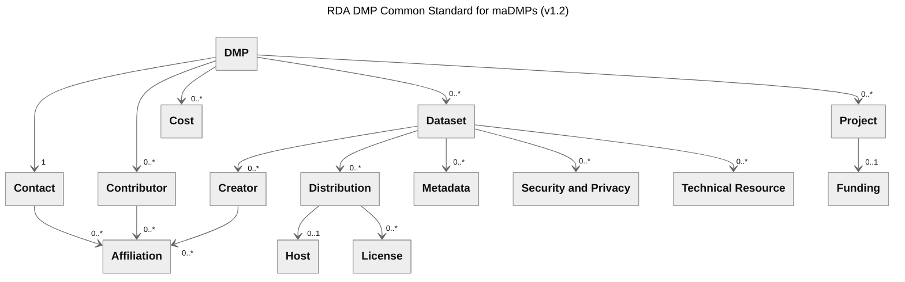

```mermaid
---
title: "RDA DMP Common Standard for maDMPs (v1.2)"

config:
  theme: 'neutral'
  class:
    hideEmptyMembersBox: true
---
classDiagram

  class Affiliation["Affiliation"]
  class Contact["Contact"]
  class Contributor["Contributor"]
  class Cost["Cost"]
  class Creator["Creator"]
  class Dataset["Dataset"]
  class DMP["DMP"]
  class Distribution["Distribution"]
  class Funding["Funding"]
  class Host["Host"]
  class License["License"]
  class Metadata["Metadata"]
  class SecurityPrivacy["Security and Privacy"]
  class TechnicalResource["Technical Resource"]

  DMP "" --> "1" Contact
  DMP "" --> "0..*" Contributor
  DMP "" --> "0..*" Cost
  DMP "" --> "0..*" Dataset
  DMP "" --> "0..*" Project

  Dataset "" --> "0..*" Creator
  Dataset "" --> "0..*" Distribution
  Dataset "" --> "0..*" Metadata
  Dataset "" --> "0..*" SecurityPrivacy
  Dataset "" --> "0..*" TechnicalResource

	Distribution "" --> "0..1" Host
	Distribution "" --> "0..*" License

  Contact "" --> "0..*" Affiliation
  Contributor "" --> "0..*" Affiliation
  Creator "" --> "0..*" Affiliation

	Project "" --> "0..1" Funding
```
